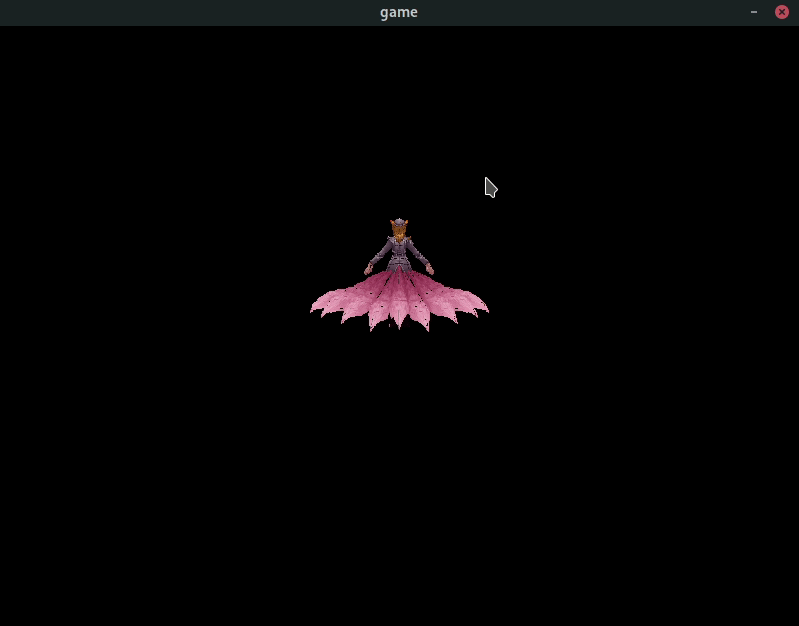

# renderer-rs

# 介绍
renderer-rs 是用 rust 从零开始实现的跨平台渲染器, 不需要安装其他依赖

# 使用
第一次编译时需要编译 sdl2,  可能会花费较多的时间
```
cargo run
```

操作
```
W             上移
S             下移
A             左移
D             右移
↑ ↓         绕 X 轴旋转
← →         绕 Y 轴旋转
滚轮向上      拉近
滚轮向下      拉远
```


